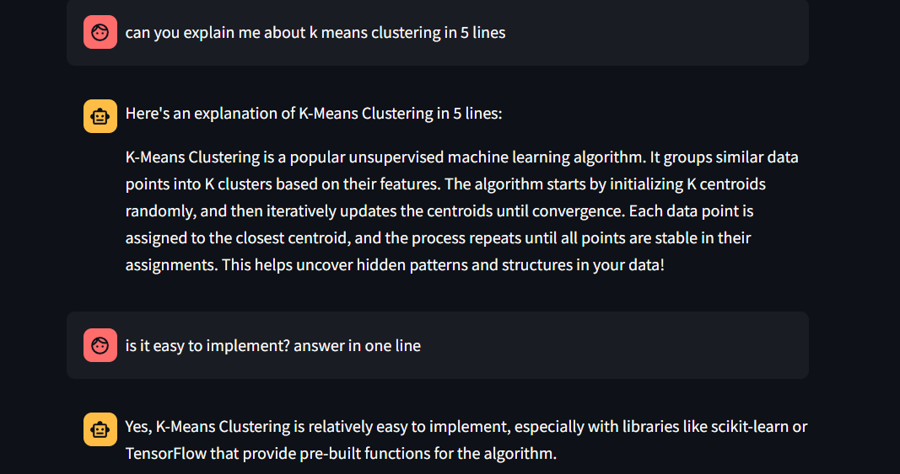

# 🤖 LLaMA 3 Chatbot using FastAPI & Streamlit

This project uses Streamlit, FastAPI, and the LLaMA 3 model to create an interactive chatbot. The application allows users to chat with the LLaMA 3 model, view conversation history, and log interactions for analytics.

## Project Overview

This project leverages the LLaMA 3 model for generating conversational responses. The application provides a user-friendly interface where users can input messages, and the chatbot responds in real-time. The conversation history is stored and displayed, and all interactions are logged for future reference.

### Features:
- **Interactive Chat Interface**: Users can type messages and receive responses from the LLaMA 3 model.
- **Conversation History**: Keeps track of previous messages exchanged between the user and the chatbot.
- **Logging**: All interactions are logged to a file for analytics and debugging purposes.
- **FastAPI Backend**: Handles the communication between the Streamlit frontend and the LLaMA 3 model.

  

###  Implement a Simple Context System  
✅ Allow the chatbot to remember past interactions within the same conversation.  
✅ Example: If the user asks, *"Tell me about Shopify,"* and then follows up with *"How does it handle payments?"* → The bot will  refer ‘it’  to Shopify.  

This project creates an **interactive chatbot** using **LLaMA 3**, **FastAPI**, and **Streamlit**.

---

## **1. FastAPI Backend**
The backend is built using **FastAPI** to serve the chatbot API.

### **Imports and Setup**
```python
import threading
import uvicorn
import requests
from fastapi import FastAPI, HTTPException
from pydantic import BaseModel
from langchain_ollama import OllamaLLM
from langchain.prompts import PromptTemplate
from langchain.memory import ConversationBufferMemory
from langchain.chains import LLMChain
import logging
```

- FastAPI for the API.
- LangChain for handling LLaMA 3 interactions.
- Logging for storing chat history

### **FastAPI App Initialization**
```python
app = FastAPI()
```
- Creates a FastAPI instance.

### **Logging Setup**
```python
logging.basicConfig(filename="chat_log.txt", level=logging.INFO, format="%(asctime)s - %(message)s")
```
- Saves user and AI responses to chat_log.txt

### **LLaMA 3 Model Initialization**
```python
llm = OllamaLLM(model="llama3")

```
- Loads the LLaMA 3 model using LangChain.
### **Chat Prompt and Memory Setup**

```python
prompt_template = PromptTemplate(
    input_variables=["chat_history", "user_input"],
    template="You are a helpful AI assistant. Here is the conversation so far:\n{chat_history}\nUser: {user_input}\nAI:"
)
memory = ConversationBufferMemory(memory_key="chat_history", return_messages=True)
chain = LLMChain(prompt=prompt_template, llm=llm, memory=memory)

```
- Maintains conversation history for contextual responses.
### **Chat API Endpoint**

```python
class ChatRequest(BaseModel):
    user_input: str

@app.post("/chat")
def chat(request: ChatRequest):
    try:
        response = chain.run({"user_input": request.user_input})
        logging.info(f"User: {request.user_input}")
        logging.info(f"AI: {response}")
        return {"response": response}
    except Exception as e:
        logging.error(f"Error: {str(e)}")
        raise HTTPException(status_code=500, detail=str(e))

```

- Receives user input via POST request.
- Processes it using LLaMA 3.
- Logs the chat history.


### **Running FastAPI in a Background Thread**
```python
def run_fastapi():
    uvicorn.run(app, host="127.0.0.1", port=8000)

threading.Thread(target=run_fastapi, daemon=True).start()
```

- Runs FastAPI in a separate thread so that it doesn't block Streamlit.


## **2. Streamlit Frontend**

The frontend is built using **Streamlit** for an interactive chat UI.

### **Streamlit Page Setup**

```python
API_URL = "http://127.0.0.1:8000/chat"

st.set_page_config(page_title="LLaMA 3 Chatbot", page_icon="🤖")

st.title("🤖 AI Chatbot")
st.write("Chat with LLaMA 3 using FastAPI!")

```

- Sets up the chat UI.


### **Session State for Chat History**

```python
if "messages" not in st.session_state:
    st.session_state.messages = []

```

- Ensures chat history persists.

### **Displaying Chat Messages**

```python
for msg in st.session_state.messages:
    with st.chat_message(msg["role"]):
        st.markdown(msg["content"])

```

- Displays previous chat messages.

### **Handling User Input**

```python
user_input = st.chat_input("Type your message...")

```
- Provides an input box for user messages.

### **Sending Input to API and Displaying Response**

```python
if user_input:
    st.session_state.messages.append({"role": "user", "content": user_input})
    response = requests.post(API_URL, json={"user_input": user_input})
    
    if response.status_code == 200:
        bot_response = response.json()["response"]
    else:
        bot_response = "⚠️ Error: Unable to get response from the server."

    st.session_state.messages.append({"role": "assistant", "content": bot_response})
    
    with st.chat_message("assistant"):
        st.markdown(bot_response)

```
- Sends user input to FastAPI.
- Sends user input to FastAPI.
- Handles errors if FastAPI is unreachable.
- Displays the AI’s response.


## Requirements

To run the project, you'll need to have the following dependencies:

- Python 3.x
- Streamlit
- FastAPI
- Uvicorn
- Requests
- Langchain
- Ollama

## Install Dependencies

You can install the necessary dependencies using pip:

```bash
pip install streamlit fastapi uvicorn requests langchain ollama
```
Additionally, you must have Ollama installed and the LLaMA 3 model pulled. You can do this by running:

```bash
ollama pull llama3
```

## How to Run

### Set Up the Model:
1. Ensure Ollama is installed and the LLaMA 3 model is pulled.


### Run the Streamlit App:
1. Open a terminal or command prompt.
2. Navigate to the directory containing the Streamlit script.
3. Run the following command to start the Streamlit app:

   ```bash
   streamlit run chatbot.py
   ```
   ### Access the Application:
After running the commands, the Streamlit app will open in your web browser. You can start chatting with the LLaMA 3 model.


---

Feel free to reach out with questions or suggestions.  
*by Shadow Phoenix*
